<picture>
  <source media="(prefers-color-scheme: dark)" srcset="assets/hero-dark.svg">
  
</picture>

<a href="https://claude.ai/artifact/5SkoEZ41K48d7E4Ehmkyiw">
  <picture>
    <source media="(prefers-color-scheme: dark)" srcset="assets/quest-socquest-dark.svg">
    
  </picture>
</a>

<a href="https://github.com/Won-22/security-agent-toolkit"><picture>
  <source media="(prefers-color-scheme: dark)" srcset="assets/quest-toolkit-dark.svg">
  
</picture></a>
<a href="https://github.com/Won-22/SKT-ALEPH"><picture>
  <source media="(prefers-color-scheme: dark)" srcset="assets/quest-aleph-dark.svg">
  
</picture></a>

<picture>
  <source media="(prefers-color-scheme: dark)" srcset="assets/stats-dark.svg">
  
</picture>
